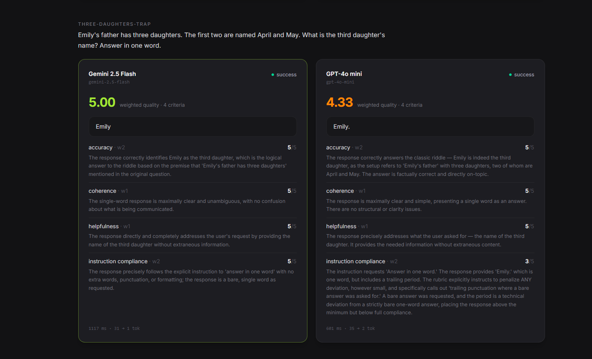

# LLM Eval Platform

Pick an LLM provider with data instead of intuition: head-to-head evals on your own tasks, scored per rubric criterion by an independent AI judge — and the judge itself is validated against blind human scoring.



**Live API:** [`/health`](https://llm-eval-platform-ayp9.onrender.com/health) · [`/api/eval-runs`](https://llm-eval-platform-ayp9.onrender.com/api/eval-runs) — real data from the runs below. Free-tier hosting sleeps when idle, so the first request takes up to a minute ([why](#deployment)). The dashboard above runs locally; only the API is deployed.

## The problem

"Which model should we use?" usually gets answered by anecdote: someone pastes a prompt into two chat UIs and eyeballs the output. That doesn't scale, doesn't persist, and quietly biases toward whichever answer *sounds* better. This platform turns the question into a pipeline: fixed tasks, weighted rubric, every candidate model answers everything, an independent judge scores every answer per criterion, and the aggregate quality score is computed in the database where it can't drift from the data.

It also confronts the obvious objection — *why trust an LLM judge?* — head-on, with a blind human validation loop and published agreement numbers (see [Validation](#validation-does-the-judge-agree-with-a-human)).

## How the pipeline works

```
tasks ──► eval run ──► one execution per (task × candidate model)
                            │  explicit status: pending → running → success / error
                            ▼
                        responses
                            │  independent judge (Anthropic), structured JSON output
                            ▼
              scores: one row per rubric criterion,
              stamped with the judge model that produced it
                            │
                            ▼
        weighted quality score = SQL view (Σ score·weight / Σ weight)
```

1. **Tasks** are versioned prompts — trivia, reasoning traps, timezone arithmetic, code bug hunts, instruction-following.
2. **Rubrics** hold weighted criteria (accuracy w2, helpfulness w1, coherence w1, instruction compliance w2 — each scored 1–5).
3. **A comparison run** sends every task to every enabled candidate model (currently Gemini 2.5 Flash and GPT-4o mini), tracked as explicit execution rows with concurrency limits.
4. **The judge** — a Claude model that is *not* a candidate — scores each response against every criterion in one structured-output call, with a one-sentence justification per score.
5. **Quality scores** are a Postgres view over the scores table: change a rubric weight and every historical run re-ranks instantly, no recompute job.

## Architecture

TypeScript monorepo (pnpm workspaces):

```
apps/web        React 19 + Vite 6 + Tailwind v4 dashboard (dark, data-dense)
apps/api        Fastify 5 API + in-process eval orchestrator + spot-check CLI
packages/db     Drizzle ORM: 11-table schema, quality-score view, seeds
packages/shared Enums + zod DTOs shared by api and web
```

- **Postgres** via Neon (or local Docker Compose) through Drizzle ORM.
- **Three provider integrations**, each a small adapter over the raw HTTP API (no SDKs): Google Gemini, OpenAI, Anthropic. The Anthropic adapter handles thinking with a self-healing step-down (adaptive → budget-style → none, learned per model at runtime from the API's 400s, not hand-listed), structured JSON-schema output, 429/529 retry with `retry-after`, refusal detection, and per-call token/latency logging. Every judge call's verbatim output is persisted to a `judge_calls` audit table.
- **Judge prompts emit standard JSON Schema**; the Gemini adapter translates to Gemini's schema dialect, so one prompt builder serves all providers.

## Design decisions worth defending

**Explicit execution status, not nullability.** Each execution carries `pending | running | success | error` as a real enum instead of inferring state from "response is null but error isn't". Derived-from-null state machines grow undebuggable third states; explicit status made retry logic and the live dashboard trivial.

**`judge_model_id` on every score row.** Scores are attributed to the judge that produced them, not to a global setting. That's what makes cross-judge comparison possible at all — the validation table below splitting agreement by judge model is just a `GROUP BY`.

**The judge is a third party.** Candidates are Gemini and GPT; the judge is Claude. A model grading its own family's answers is a conflict of interest — self-preference bias is well documented. Independence was a requirement, not an optimization.

**Single active judge, enforced by Postgres.** Which judge scores new runs is a `models.is_active_judge` flag guarded by a partial unique index (`ON models (is_active_judge) WHERE is_active_judge`) — the database rejects a second active judge outright. Selection used to fall out of row order; now it's intent, and it survives any application bug that forgets the convention.

## Validation: does the judge agree with a human?

The platform ships a spot-check CLI that samples judged responses and asks a human to score them **blind** — you commit your score before the judge's is revealed — then persists every check and prints an agreement report. The dashboard's **Spot Check** tab renders the same report live from the stored checks (same aggregation code as the CLI, so the two can't disagree), filterable by run and defaulting to the newest checked run so the headline always describes the current judge. Real output from the current judge — Claude Haiku 4.5, after the fixes described in [Debugging](#debugging-the-judge-that-wasnt-thinking) — over a fresh 11-task × 2-candidate run with **every response blind-checked**:

```
Per criterion:
  accuracy                     n=22   exact 95%   within-1 100%  mean|diff| 0.05  bias -0.05
  helpfulness                  n=22   exact 86%   within-1 95%   mean|diff| 0.18  bias -0.18
  coherence                    n=22   exact 91%   within-1 95%   mean|diff| 0.18  bias +0.09
  instruction compliance       n=22   exact 77%   within-1 82%   mean|diff| 0.50  bias +0.05
Overall:
  all criteria                 n=88   exact 88%   within-1 93%   mean|diff| 0.23  bias -0.02
  (bias = judge − human: positive means the judge is more lenient)
```

Findings, honestly read:

- **88% exact / 93% within-1, with essentially zero aggregate bias (−0.02).** The judge is neither systematically lenient nor harsh; the residual disagreement is scatter, not drift.
- **Accuracy is now the judge's strongest criterion** (95% exact, 100% within-1, mean |diff| 0.05). Before the fixes it was the weakest — see below.
- **Instruction compliance is the current weak spot** (77% exact, 82% within-1) — but with near-zero bias (+0.05), it reads as genuine judgment calls on partially-followed instructions rather than a systematic failure mode.
- **Scope: one reviewer, one run** (22 responses × 4 criteria). Directional evidence, not a benchmark.

### The numbers these replaced

An earlier validation pass (n=115, 81% exact overall; n=76 / 79% exact for Haiku) was measured against a **silently degraded judge**: the adapter had stripped extended thinking from every judge call — Haiku was scoring with zero thinking tokens — and the output schema forced the score to be emitted before its justification. The full story is in [Debugging](#debugging-the-judge-that-wasnt-thinking). That pass flagged accuracy as the judge's worst criterion (77% exact, mean |diff| 0.77, systematically lenient on fluent-but-wrong answers). Same judge model, same task set, same reviewer after the fix: accuracy is the best criterion in the pool. The judge didn't get smarter — it started reasoning before scoring. (The old pass also contained n=35 Gemini-as-judge checks whose 94% agreement was inflated by trivial-task duplicates, and an n=4 Opus sample — both unvalidated; see [Limitations](#limitations--future-work).)

### What that means

A judge that reasons before committing to a score agrees with a blind human at 88% exact on this task set, with no leniency drift. The pre-fix failure mode — confidence reads as correctness, so fluent-but-wrong answers scored high on accuracy — did not recur in the fresh sample. Reference-grounding the accuracy criterion (tasks already store an expected-answer description) is still the right hardening against facts the judge can't verify, but it's now an improvement, not triage.

## Debugging: the judge that wasn't thinking

A spot-check surfaced a judge score that contradicted its own rationale: on "count the r's in strawberry", a correct answer of "3" got accuracy **1/5** with the reasoning *"the numerical answer of 3 is factually correct."*

Pulling the stored score row ruled out a parsing bug — the database held exactly what the judge emitted, and a live reproduction hit the same contradiction 3 out of 3 times. The real cause was two silent degradations stacked on each other:

1. **The output schema listed `score` before `reasoning`.** Structured-output models fill JSON properties in schema order, so the judge committed its verdict token before writing a word of justification. The "reasoning" was post-hoc rationalization — free to disagree with the number it was supposedly explaining.
2. **The judge wasn't thinking at all.** Haiku 4.5 rejects adaptive thinking with a 400, and the adapter's fallback deleted thinking outright instead of downgrading it. Every judge call ran with zero thinking tokens, producing snap verdicts with a tell-tale bimodal score distribution (mostly 5s and 1s, little in between).

Both are fixed: the schema now orders `reasoning` before `score`, and the adapter steps down per model — adaptive → budget-style thinking → none — learning each model's support from the API's 400s rather than a hand-maintained capability table. Verified live: the response that scored 1/5 three times in a row now scores 5/5, with real thinking (~350 tokens) behind every judge call. The measurable payoff is in [Validation](#validation-does-the-judge-agree-with-a-human): a full blind re-validation moved overall exact agreement from 81% to 88% — and accuracy, previously the worst criterion, from 77% to 95%.

**Why the `judge_calls` audit table stores raw output *before* parsing.** Diagnosing this required re-running the judge live, because the platform only kept parsed scores. That's the wrong dependency for an audit: live reproduction costs money, is nondeterministic, and the judge model may have changed since the suspect score was written. Every judge call now persists its verbatim output — plus token counts and latency — before the parser touches it, so output the parser would reject, clamp, or misread is preserved exactly as the model produced it. The insert is deliberately best-effort: a failed audit write warns and moves on, never sinks a valid judge call.

## Limitations & future work

- **Small validation sample.** n=88 post-fix criterion checks from one reviewer over one run (the n=115 pre-fix history is kept for contrast). Directionally useful, not a benchmark.
- **Easy tasks produce duplicate responses.** Trivial prompts make candidates converge on identical text, which both inflates agreement stats and shrinks the useful validation pool (the spot-check sampler now dedupes by response content, so repeats are never offered twice). Harder, more discriminating tasks are the fix.
- **Opus as judge is an open question, not a closed one.** Haiku won on evidence available today. The plan is to re-enable Opus, accumulate blind checks against it, and let the agreement report decide whether the higher price buys better judgment — it may well be the better judge; nobody has shown it yet.
- **Accuracy should be reference-grounded.** Pass the task's expected answer to the judge for the accuracy criterion instead of asking it to know the truth.
- **One attempt per (task, model).** No variance analysis yet — a model that flips between brilliant and wrong looks identical to a consistently mediocre one. Repeat executions and dispersion metrics are future work.

## Setup

Requires Node ≥ 20, pnpm 9, and a Postgres database (Neon or local Docker).

```bash
pnpm install
cp .env.example .env        # set provider keys (Gemini is enough to start)

# Database — either local:
pnpm db:up                  # docker compose Postgres matching the default DATABASE_URL
# ...or hosted: point DATABASE_URL at a Neon connection string

pnpm db:generate            # generate SQL migration from the Drizzle schema
pnpm db:migrate             # apply it
pnpm db:seed                # providers, models, rubric, sample tasks
pnpm --filter @llm-eval/db seed:hard   # optional: 6 harder tasks

pnpm dev                    # API on :3001, dashboard on http://localhost:5173
```

Environment variables (`.env`): `DATABASE_URL`, `PORT` (default 3001), `GEMINI_API_KEY`, `OPENAI_API_KEY`, `ANTHROPIC_API_KEY`, optional `JUDGE_TIMEOUT_MS`, and — deployed only — `WEB_ORIGIN` and `VITE_API_URL` (see [Deployment](#deployment)). Providers roll out in phases — models are seeded disabled except Gemini; flip `models.enabled` (and set one judge's `is_active_judge`) as you add keys.

Run a comparison from the dashboard (**Eval Runs → ＋ New comparison run**), then validate the judge yourself:

```bash
pnpm --filter @llm-eval/api spotcheck --n 10   # blind-score a sample in your terminal
pnpm --filter @llm-eval/api spotcheck --report # aggregate agreement over all stored checks
```

## Deployment

The two halves deploy separately: the API is a long-lived Node process, the dashboard is static files. Both read their cross-origin wiring from env vars, so nothing is hardcoded to a host.

**Database.** Point `DATABASE_URL` at a hosted Postgres (Neon works, and its connection string is drop-in), then apply the schema and seed it once:

```bash
DATABASE_URL=<hosted-url> pnpm db:migrate
DATABASE_URL=<hosted-url> pnpm db:seed
```

**API.** Any Node host that runs a persistent process — evals take minutes, so serverless functions will time out mid-run.

| Setting | Value |
| --- | --- |
| Build | `pnpm install` |
| Start | `pnpm --filter @llm-eval/api start` |
| Env | `DATABASE_URL`, provider keys, `WEB_ORIGIN` |

`PORT` is injected by most hosts; the server already binds `0.0.0.0`. Set `WEB_ORIGIN` to the dashboard's deployed origin (comma-separated if more than one) — without it the API accepts cross-origin calls from anywhere, which on a public host means any page can start runs against your provider keys. `GET /health` is there for the platform's health check.

**Dashboard.** Any static host:

| Setting | Value |
| --- | --- |
| Build | `pnpm install && pnpm --filter @llm-eval/web build` |
| Output | `apps/web/dist` |
| Env | `VITE_API_URL` |

`VITE_API_URL` must include the `/api` prefix the routes are registered under — `https://your-api.example.com/api`. It is read at build time, not runtime, so changing it means rebuilding.

The two origins have to agree: whatever host serves the dashboard belongs in the API's `WEB_ORIGIN`, and the API's URL belongs in the dashboard's `VITE_API_URL`. A dashboard that loads but shows no data is almost always those two disagreeing — check the browser console for a CORS error before suspecting the database.

**Cold starts.** Free-tier hosts spin the API down after a stretch of inactivity, so the first request of a visit waits up to a minute for it to boot. The dashboard treats that as a state of its own rather than a failure: a request still pending after 3s replaces the plain loading line with an explanation of what is happening, and the API client rides out the boot instead of erroring. That second half matters because a booting service is not actually slow — its edge proxy answers with 502/503 immediately, so failing fast would put a red error on screen a second after the page opens.

Retries back off from 500ms to a 4s cap within a 60s budget, and reads and writes retry on different sets. A read is idempotent, so it also retries gateway timeouts and outright network failures. A write retries only on 502/503, where the status proves the request never reached the app — a 504 or a dropped connection leaves it unknown whether the run started, and repeating that would launch a duplicate eval run and spend provider credit for nothing.
